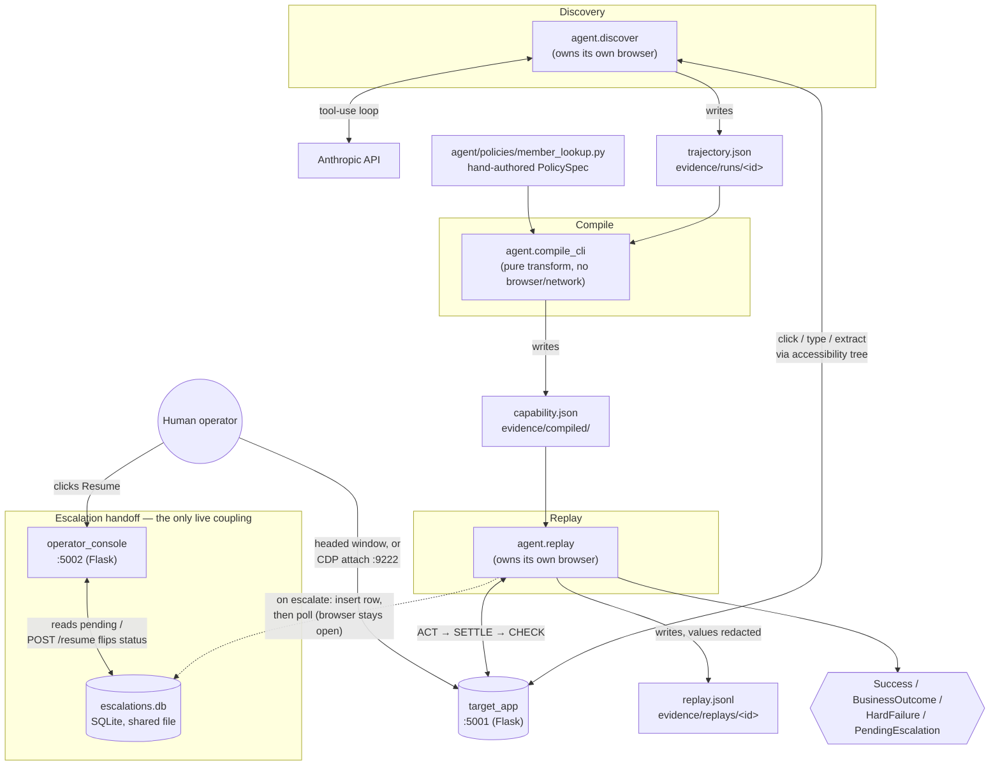
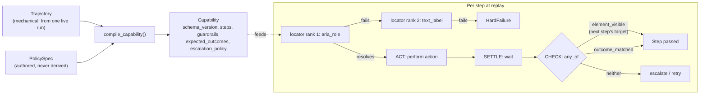
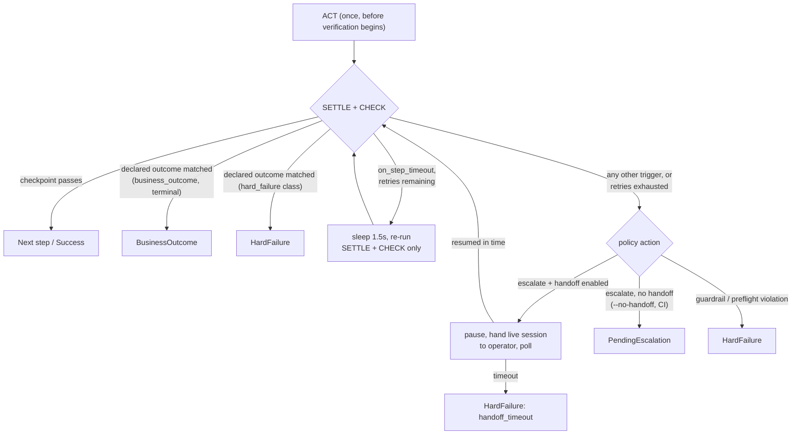
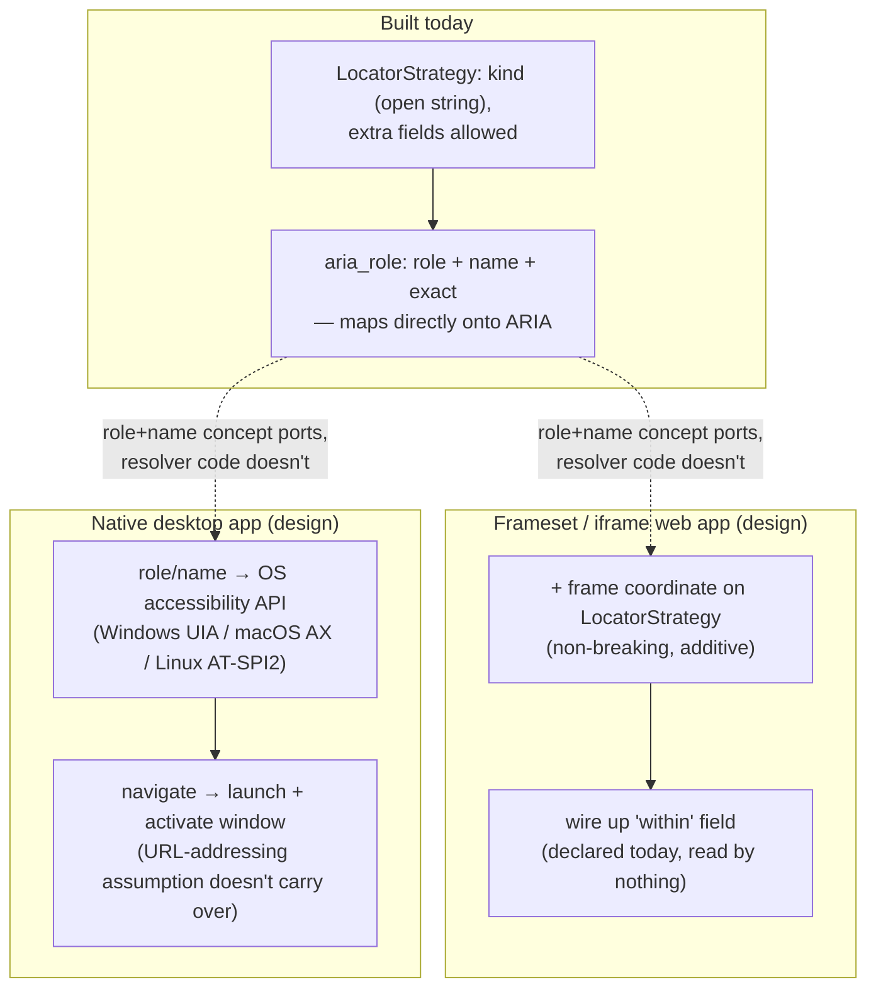

# Design Write-Up — discovery-replay

## 1. Architecture

The system is five processes that hand off through typed artifacts and files, not live calls. Two run as servers: target_app (Flask, port 5001, the hostile legacy UI being automated) and operator_console (Flask, port 5002, the escalation handoff surface). Three run as short-lived CLIs, each owning its own Playwright browser directly: agent.discover, agent.compile_cli, and agent.replay.

Discovery and replay never talk to each other, and neither talks to the compiler at runtime. Discovery writes a Trajectory to disk (evidence/runs/<id>/trajectory.json). The compiler reads that plus a hand-authored PolicySpec module and writes a Capability artifact. Replay reads that artifact and produces one of four typed results (Success, BusinessOutcome, HardFailure, PendingEscalation). The only runtime coupling between two live processes is replay and the operator console, which share one SQLite file recording pending escalations. Nothing else connects them. The console never touches the browser directly. It renders context and flips a status field.

Four decisions carried the most weight.

First, the artifact has two layers, and the policy layer is never derived. A single successful discovery run only proves the happy path. It has no evidence about which failures are legitimate business outcomes, how risky an action is, or how long to wait before escalating. The compiler merges in a separately authored PolicySpec for those fields, and a missing required field fails compilation loudly rather than defaulting to something permissive.

Second, discovery and replay share one perception module, one accessibility-snapshot representation of the page, and one exact-name resolution rule. If discovery reasoned over screenshots while replay resolved by CSS, the artifact's locators would be built from a representation replay doesn't share. Exact matching specifically exists because the target app's nested table markup means a leaf element's accessible name is often a substring of its wrapper's concatenated name, which makes default substring matching structurally ambiguous.

Third, a step's action is a one-shot call made once, outside any retry loop. Every automatic retry and every human resume re-enters only the settle-and-check phase. Re-firing an action that already completed, which is how a mutating step gets double-submitted, is structurally impossible rather than a convention someone could forget.

Fourth, escalation is a synchronous poll against SQLite, not a queue or an async event loop. Two local processes need durable shared state while one blocks for minutes and the other writes once. That's a proportionate answer for a single-operator, single-machine scope, not a shortcut, since the brief explicitly scopes out a full co-browsing console.

Deliberately absent: any queue, worker, or async runtime; any multi-tenant routing, credential store, or per-tenant config; any deployment layer beyond dev servers on localhost. These are real omissions, not oversights, and each one is a decision to design abstractions that could be extended later rather than build infrastructure against imagined load now. The interfaces that a scaled version would need already exist as data and contracts, not code waiting to be rewritten: the versioned artifact schema, the mechanical/policy split, the guardrails block, and the four-way result contract.

Python 3.11+, Flask, Pydantic v2, Playwright, and stdlib sqlite3. Pydantic v2 matters most: the artifact is the product, so it needs strict validation (extra="forbid" on every model) and cross-field rules that catch a malformed artifact at load time, not mid-replay.

## 2. Artifact schema

A capability artifact has two layers, and only one of them is derived from anything discovery observed. The mechanical layer, ordinal steps, ranked locators, checkpoints, is a generalized transcript of one successful run. The policy layer, risk classification, expected outcomes, guardrails, escalation policy, is authored separately and merged in at compile time. Capability rejects unknown fields entirely (extra="forbid"), and a missing required policy field fails compilation loudly rather than defaulting to something permissive. One field enforces this directly: replay refuses to run any artifact whose policy layer was never authored — policy_authored_by must be set. An artifact that was never reviewed by a human can't execute.

Locators are a ranked list, not a single selector, because no one strategy is reliable across a legacy surface. aria_role, matching by accessible role and name, is the only strategy actually exercised end to end; every locator in the compiled artifact resolves on rank 1. text_label exists as a documented fallback but has never been hit in a real run. test_id is named in the schema as a reserved strategy for a more modern surface but has no resolver behind it yet, an honest placeholder, not a working fallback. The model is deliberately permissive here (extra="allow") in contrast to the strict structural models elsewhere, since the set of locator strategies is expected to grow as the system meets less cooperative UIs.

Checkpoints determine whether a step succeeded, and every one of them is wrapped any_of[element_visible, outcome_matched]. This isn't decoration. Replaying against a member the teller isn't authorized to see returns HTTP 403 and an "Access Denied" page, not the record table a checkpoint would normally look for. Without outcome_matched, that checkpoint just reads false, and a routine, expected denial escalates to a human and blocks for fifteen minutes. With it, detect_outcome walks the artifact's declared expected_outcomes in order, matches the first satisfied detection rule, in this case an HTTP-status check, and the run returns a clean, typed BusinessOutcome instead. The same distinction is what separates a legitimate "no such member" answer from a hang.

Inputs and outputs are typed and named, not positional. A step's locator or value can reference a declared input by template ({{search_term}}), and a cross-field validator confirms every template token resolves to something the artifact actually declares, so a stray reference fails at load rather than mid-replay. Output names are explicitly normalized at compile time through output_name_mapping, so a capability's contract reflects what the policy author intends to call a value, not whatever a given discovery run happened to name it internally. This mapping is required for every output a trajectory produced, not optional, so nothing ships under an unaccounted-for name.

Risk classification and guardrails aren't advisory. guardrails is a required field with required sub-fields, an artifact can't skip declaring an allowlist, so the empty-guardrails failure mode doesn't exist as a silent pass; if a route allowlist were somehow empty, the very first step would hard-fail before any navigation or interaction. requires_confirmation is the one field that was declared but not enforced until late in this build; replay now refuses to run a capability that sets it without an explicit --confirmed flag, closing what had been a real gap between the schema's intent and the engine's behavior.

schema_version and version serve different purposes, and only one is currently enforced. schema_version is a literal the model hard-rejects if it doesn't match, load-time protection against an incompatible future shape. version, the artifact's own semver, is presently a label: it flows into logs and evidence but nothing in the replay engine reads or compares it. The distinction between the two capability versions built during this project, one supporting only ID lookup, one supporting both search modes, makes the case for why the field needs to exist even without enforcement yet: a caller written against the older contract would fail cleanly against the newer one's now-required search_field input, and version is what lets that difference be named rather than discovered by surprise.

## 3. Determinism & error handling

Replay is deterministic because nothing in its decision path involves a model or randomness. Every choice, which action a step performs, which ranked locator gets tried first, whether a checkpoint passes, which declared outcome matches, what result type comes out the other end, is a lookup against the frozen artifact. Two runs with the same capability and the same inputs walk an identical sequence of steps in an identical order, evaluated against identical rules.

What genuinely varies between two such runs is narrower than it might sound, and worth stating honestly rather than glossing over: wall-clock timing, whether a retry actually fires, and which internal wait strategy resolves first (a network-idle wait versus its DOM-stable fallback). None of these change the outcome, since a retry only ever re-runs verification, never the action itself. There is one real, if currently latent, non-determinism worth naming: the detail-page link is matched by a name prefix with nth=0, since the exact member name isn't known at compile time. If a search ever matched more than one row, "first" would depend on the target app's own result ordering rather than anything replay controls. The ordering is stable today; it isn't structurally guaranteed to stay that way.

Only one trigger ever retries: a step that times out waiting to settle. Everything else, an unresolved locator, a failed checkpoint, an unrecognized dialog, converts straight to escalation regardless of how the policy is configured, because retrying those wouldn't help and could mask a real problem. A timing-out step gets three evaluations total with a flat 1.5-second backoff between them, then falls through to escalation. Retrying is structurally confined to re-running settle-and-check: the action itself is invoked exactly once, before any retry logic is even reachable, so there is no code path capable of firing a mutating click twice.

The result contract makes the three-way distinction the brief asks for real rather than documented. A Success carries the declared outputs, unredacted, returned in-process, never written to the evidence log. A BusinessOutcome, a permission denial, a not-found search, a review-required interstitial, carries the matched outcome code and description, and exits cleanly rather than looking like a failure. A HardFailure names the step, the phase it broke in, a machine-readable trigger, and an expected-versus-observed pair meant to be diagnosable without a stack trace. A PendingEscalation is what a caller gets when the policy says to escalate but no human handoff is available, the path used in CI.

That expected-versus-observed design paid off during this build. The target app's ~4-second injected slow load once tripped a fixed click timeout inside the action phase itself, before the step's settle window ever got a chance to absorb it. Because that failure happened outside the normal checkpoint path, it surfaced as a raw exception rather than a clean, structured result, a debuggable gap in the error handling that then got closed: the action's timeout now honors the same settle bound the step already declares, so the slow page is absorbed where it's supposed to be. The fix is small; the reason it needed fixing is exactly the class of problem this section is asking about, a legitimate runtime condition the artifact hadn't accounted for correctly, found once, by actually hitting it.

On UI drift specifically: this isn't built, and it's worth saying so plainly rather than implying otherwise. Nothing compares the live page against what discovery recorded. The target app's UI is deliberately stable, so this was a scoped decision rather than an oversight, but drift isn't detected, it's contained. If the UI did change, a renamed control fails locator resolution and escalates with the exact accessible name that no longer resolves; a restructured page fails a checkpoint and escalates with a trace; a redirect trips the narrowed route allowlist and hard-fails outright. Real drift detection would need a structural fingerprint of each step's page captured at compile time and diffed at replay, none of which exists today; what does exist ensures that drift, if it happened, would surface as an actionable failure rather than a silent wrong answer.

Timeouts apply at several independent layers rather than one global clock: a per-step settle bound (2 to 12 seconds depending on the step, drawn from the artifact itself), a fixed 4-second window per ranked locator attempt, per-action timeouts inside the action phase (a flat 4 seconds for fill/select_option/press_key; for a navigating click, the larger of 4 seconds or the step's own settle bound, so slow pages are absorbed rather than tripping the action itself), and a 900-second (configurable) human handoff window. There is no overall wall-clock limit on a replay run; its total duration is bounded only by the sum of these individually-scoped waits.

## 4. Heterogeneity & multi-tenant

This section is design, not build, per the brief's own scope. Where
something below is already true of the code, it's marked as such; the
rest is a credible extension of decisions already made, not a promise of
what exists.

The seam between perception and the recorded flow is real but informal,
not a clean interface. There's no Surface protocol; perception.py and
the resolver inside replay.py import Playwright's Page/Locator directly.
What is surface-neutral is the artifact's vocabulary: a locator's kind
is an open string, not an enum, and the model accepts extra fields, so a
new locator strategy validates today with zero schema change. Role-and-
name matching itself isn't a browser concept, it's an accessibility-tree
concept, and that's what makes the rest of this section possible at all.
The honest split: adding a new browser resolution strategy is
low-friction; swapping in a non-browser perception backend, an OS
accessibility API for a desktop app, would need a real protocol
extracted from the current concrete class first. The data model would
mostly survive that refactor; the code doesn't have the seam pre-built.

A legacy frameset app is the closer extension. target_app already has
one unrelated iframe, and checking against it confirms Playwright's
accessibility snapshot doesn't pierce frame boundaries, elements inside
a child frame would currently resolve to zero matches, indistinguishable
from "the element doesn't exist" rather than "the surface isn't
supported yet." That's a real gap, not a hypothetical one. The fix is
additive rather than architectural: a frame coordinate on
LocatorStrategy (free, given the schema already allows extra fields),
frame-aware resolution in the perception and resolver layers, and
finally wiring up the within field, which is declared in the schema
today but read by nothing. None of this touches the step model, the
checkpoint composites, the outcome taxonomy, or the mechanical/policy
split.

A native desktop app is a bigger lift, but the project's central bet,
reason over an accessibility tree rather than pixels or raw markup, is
exactly what makes it tractable at all. The artifact schema, the
escalation state machine, the three-way result taxonomy, and the
ACT/SETTLE/CHECK contract are surface-neutral and would carry over with
mostly additive field changes. What needs a parallel build is
everything below that: perception itself, the resolver, and specifically
the navigation model, since navigate/base_url/route-allowlisting all
assume URL addressing, which a desktop app simply doesn't have. The
operator-handoff mechanism is the sharpest edge: the current CDP attach
works because Chrome happens to expose a remarkably convenient
remote-control primitive. A desktop equivalent, screen-sharing or an
accessibility-driver attach, is a genuinely harder problem, not a
drop-in swap.

Multi-tenant reuse is where the design already earns something real: a
compiled capability's base_url is overridable at replay time with no
recompilation, so pointing the same artifact at a second tenant's host
works today. Locators built from accessible role and name, rather than
CSS selectors or DOM structure, survive exactly the kind of change
branding usually makes, colors, logos, fonts, layout, because none of
that touches ARIA roles or a control's functional label. That's genuine
portability against theming, not an optimistic claim. It has a real
limit, though: if a tenant customizes the label itself, "Savings
Balance" instead of "Savings balance", both the primary and fallback
locator break together, since both are built from the same literal text.
A structural locator strategy — css or xpath — is reserved in the schema
as a last-resort fallback but never emitted by the compiler today, which
is the natural next step if aggressive per-tenant customization becomes
a real problem rather than a theoretical one.

The credible design for reuse without re-recording per tenant is a small
override layer merged over a base capability: a per-tenant document
carrying only the deltas, base_url, any customized labels, any
tenant-specific outcome text, rather than a full re-record. Because the
schema already tolerates extra fields, this kind of layering doesn't
require a migration to add. Drift detection across tenants running
different versions of the same vendor product doesn't exist today, and
that's worth stating as plainly here as in the determinism section, but
there's a concrete, already-present hook worth building on rather than
starting cold: discovery already stores a structural fingerprint of each
step's page, unused by anything right now. A pre-flight compatibility
probe, resolving every step's locator against a new tenant without
acting on anything, is a natural dry-run mode for the resolver that
already exists, and comparing that fingerprint across tenants would flag
a materially different vendor-product version before a real run ever
touches it.

Whether the mechanical/policy split itself helps or hurts multi-tenant
reuse is a genuine mixed answer, not a self-serving one. It helps in the
place that matters most: the policy layer, is this read-only, is this
outcome a business result rather than a failure, how risky is this, is
judgment that's true for every tenant on the same vendor product, and
it's written once rather than re-derived per tenant. It doesn't, by
itself, solve tenant parameterization; routes and labels still live in
the mechanical layer and still need the override mechanism described
above. And one deliberate choice cuts the other way: guardrail routes
are narrowed to exactly the paths one trajectory visited, which is the
right call for single-tenant blast-radius control but bakes in one
tenant's URL structure as a hard constraint. Extending that to
pattern-based or per-tenant routes is a real trade-off against tightened
safety, not a free improvement.

## 5. Escalation & handoff

## 6. Safety

## 7. Cuts