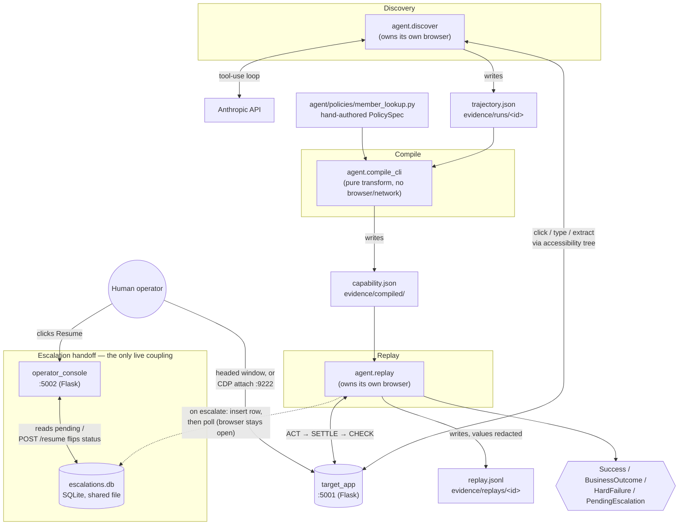

# Design Write-Up — discovery-replay

## 1. Architecture

The system is five processes that hand off through typed artifacts and files, not live calls. Two run as servers: target_app (Flask, port 5001, the hostile legacy UI being automated) and operator_console (Flask, port 5002, the escalation handoff surface). Three run as short-lived CLIs, each owning its own Playwright browser directly: agent.discover, agent.compile_cli, and agent.replay.

Discovery and replay never talk to each other, and neither talks to the compiler at runtime. Discovery writes a Trajectory to disk (evidence/runs/<id>/trajectory.json). The compiler reads that plus a hand-authored PolicySpec module and writes a Capability artifact. Replay reads that artifact and produces one of four typed results (Success, BusinessOutcome, HardFailure, PendingEscalation). The only runtime coupling between two live processes is replay and the operator console, which share one SQLite file recording pending escalations. Nothing else connects them. The console never touches the browser directly. It renders context and flips a status field.

Four decisions carried the most weight.

First, the artifact has two layers, and the policy layer is never derived. A single successful discovery run only proves the happy path. It has no evidence about which failures are legitimate business outcomes, how risky an action is, or how long to wait before escalating. The compiler merges in a separately authored PolicySpec for those fields, and a missing required field fails compilation loudly rather than defaulting to something permissive.

Second, discovery and replay share one perception module, one accessibility-snapshot representation of the page, and one exact-name resolution rule. If discovery reasoned over screenshots while replay resolved by CSS, the artifact's locators would be built from a representation replay doesn't share. Exact matching specifically exists because the target app's nested table markup means a leaf element's accessible name is often a substring of its wrapper's concatenated name, which makes default substring matching structurally ambiguous.

Third, a step's action is a one-shot call made once, outside any retry loop. Every automatic retry and every human resume re-enters only the settle-and-check phase. Re-firing an action that already completed, which is how a mutating step gets double-submitted, is structurally impossible rather than a convention someone could forget.

Fourth, escalation is a synchronous poll against SQLite, not a queue or an async event loop. Two local processes need durable shared state while one blocks for minutes and the other writes once. That's a proportionate answer for a single-operator, single-machine scope, not a shortcut, since the brief explicitly scopes out a full co-browsing console.

Deliberately absent: any queue, worker, or async runtime; any multi-tenant routing, credential store, or per-tenant config; any deployment layer beyond dev servers on localhost. These are real omissions, not oversights, and each one is a decision to design abstractions that could be extended later rather than build infrastructure against imagined load now. The interfaces that a scaled version would need already exist as data and contracts, not code waiting to be rewritten: the versioned artifact schema, the mechanical/policy split, the guardrails block, and the four-way result contract.

Python 3.11+, Flask, Pydantic v2, Playwright, and stdlib sqlite3. Pydantic v2 matters most: the artifact is the product, so it needs strict validation (extra="forbid" on every model) and cross-field rules that catch a malformed artifact at load time, not mid-replay.

## 2. Artifact schema

## 3. Determinism & error handling

## 4. Heterogeneity & multi-tenant

## 5. Escalation & handoff

## 6. Safety

## 7. Cuts