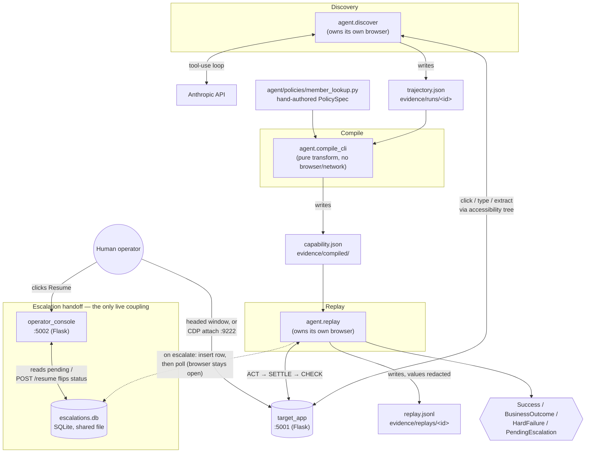
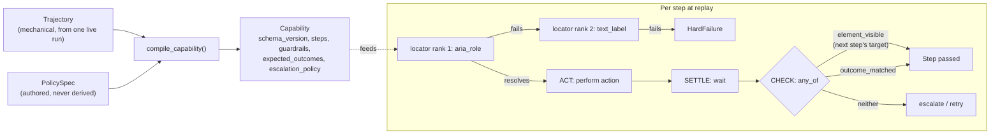

# Design Write-Up — discovery-replay

## 1. Architecture

The system is five processes that hand off through typed artifacts and files, not live calls. Two run as servers: target_app (Flask, port 5001, the hostile legacy UI being automated) and operator_console (Flask, port 5002, the escalation handoff surface). Three run as short-lived CLIs, each owning its own Playwright browser directly: agent.discover, agent.compile_cli, and agent.replay.

Discovery and replay never talk to each other, and neither talks to the compiler at runtime. Discovery writes a Trajectory to disk (evidence/runs/<id>/trajectory.json). The compiler reads that plus a hand-authored PolicySpec module and writes a Capability artifact. Replay reads that artifact and produces one of four typed results (Success, BusinessOutcome, HardFailure, PendingEscalation). The only runtime coupling between two live processes is replay and the operator console, which share one SQLite file recording pending escalations. Nothing else connects them. The console never touches the browser directly. It renders context and flips a status field.

Four decisions carried the most weight.

First, the artifact has two layers, and the policy layer is never derived. A single successful discovery run only proves the happy path. It has no evidence about which failures are legitimate business outcomes, how risky an action is, or how long to wait before escalating. The compiler merges in a separately authored PolicySpec for those fields, and a missing required field fails compilation loudly rather than defaulting to something permissive.

Second, discovery and replay share one perception module, one accessibility-snapshot representation of the page, and one exact-name resolution rule. If discovery reasoned over screenshots while replay resolved by CSS, the artifact's locators would be built from a representation replay doesn't share. Exact matching specifically exists because the target app's nested table markup means a leaf element's accessible name is often a substring of its wrapper's concatenated name, which makes default substring matching structurally ambiguous.

Third, a step's action is a one-shot call made once, outside any retry loop. Every automatic retry and every human resume re-enters only the settle-and-check phase. Re-firing an action that already completed, which is how a mutating step gets double-submitted, is structurally impossible rather than a convention someone could forget.

Fourth, escalation is a synchronous poll against SQLite, not a queue or an async event loop. Two local processes need durable shared state while one blocks for minutes and the other writes once. That's a proportionate answer for a single-operator, single-machine scope, not a shortcut, since the brief explicitly scopes out a full co-browsing console.

Deliberately absent: any queue, worker, or async runtime; any multi-tenant routing, credential store, or per-tenant config; any deployment layer beyond dev servers on localhost. These are real omissions, not oversights, and each one is a decision to design abstractions that could be extended later rather than build infrastructure against imagined load now. The interfaces that a scaled version would need already exist as data and contracts, not code waiting to be rewritten: the versioned artifact schema, the mechanical/policy split, the guardrails block, and the four-way result contract.

Python 3.11+, Flask, Pydantic v2, Playwright, and stdlib sqlite3. Pydantic v2 matters most: the artifact is the product, so it needs strict validation (extra="forbid" on every model) and cross-field rules that catch a malformed artifact at load time, not mid-replay.

## 2. Artifact schema

A capability artifact has two layers, and only one of them is derived from anything discovery observed. The mechanical layer, ordinal steps, ranked locators, checkpoints, is a generalized transcript of one successful run. The policy layer, risk classification, expected outcomes, guardrails, escalation policy, is authored separately and merged in at compile time. Capability rejects unknown fields entirely (extra="forbid"), and a missing required policy field fails compilation loudly rather than defaulting to something permissive. One field enforces this directly: replay refuses to run any artifact whose policy layer was never authored — policy_authored_by must be set. An artifact that was never reviewed by a human can't execute.

Locators are a ranked list, not a single selector, because no one strategy is reliable across a legacy surface. aria_role, matching by accessible role and name, is the only strategy actually exercised end to end; every locator in the compiled artifact resolves on rank 1. text_label exists as a documented fallback but has never been hit in a real run. test_id is named in the schema as a reserved strategy for a more modern surface but has no resolver behind it yet, an honest placeholder, not a working fallback. The model is deliberately permissive here (extra="allow") in contrast to the strict structural models elsewhere, since the set of locator strategies is expected to grow as the system meets less cooperative UIs.

Checkpoints determine whether a step succeeded, and every one of them is wrapped any_of[element_visible, outcome_matched]. This isn't decoration. Replaying against a member the teller isn't authorized to see returns HTTP 403 and an "Access Denied" page, not the record table a checkpoint would normally look for. Without outcome_matched, that checkpoint just reads false, and a routine, expected denial escalates to a human and blocks for fifteen minutes. With it, detect_outcome walks the artifact's declared expected_outcomes in order, matches the first satisfied detection rule, in this case an HTTP-status check, and the run returns a clean, typed BusinessOutcome instead. The same distinction is what separates a legitimate "no such member" answer from a hang.

Inputs and outputs are typed and named, not positional. A step's locator or value can reference a declared input by template ({{search_term}}), and a cross-field validator confirms every template token resolves to something the artifact actually declares, so a stray reference fails at load rather than mid-replay. Output names are explicitly normalized at compile time through output_name_mapping, so a capability's contract reflects what the policy author intends to call a value, not whatever a given discovery run happened to name it internally. This mapping is required for every output a trajectory produced, not optional, so nothing ships under an unaccounted-for name.

Risk classification and guardrails aren't advisory. guardrails is a required field with required sub-fields, an artifact can't skip declaring an allowlist, so the empty-guardrails failure mode doesn't exist as a silent pass; if a route allowlist were somehow empty, the very first step would hard-fail before any navigation or interaction. requires_confirmation is the one field that was declared but not enforced until late in this build; replay now refuses to run a capability that sets it without an explicit --confirmed flag, closing what had been a real gap between the schema's intent and the engine's behavior.

schema_version and version serve different purposes, and only one is currently enforced. schema_version is a literal the model hard-rejects if it doesn't match, load-time protection against an incompatible future shape. version, the artifact's own semver, is presently a label: it flows into logs and evidence but nothing in the replay engine reads or compares it. The distinction between the two capability versions built during this project, one supporting only ID lookup, one supporting both search modes, makes the case for why the field needs to exist even without enforcement yet: a caller written against the older contract would fail cleanly against the newer one's now-required search_field input, and version is what lets that difference be named rather than discovered by surprise.

## 3. Determinism & error handling

## 4. Heterogeneity & multi-tenant

## 5. Escalation & handoff

## 6. Safety

## 7. Cuts